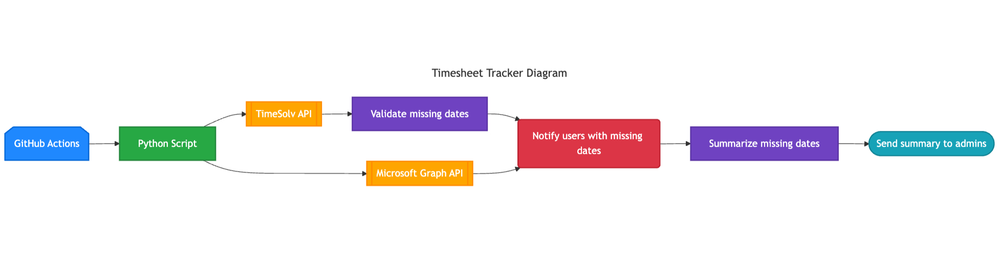
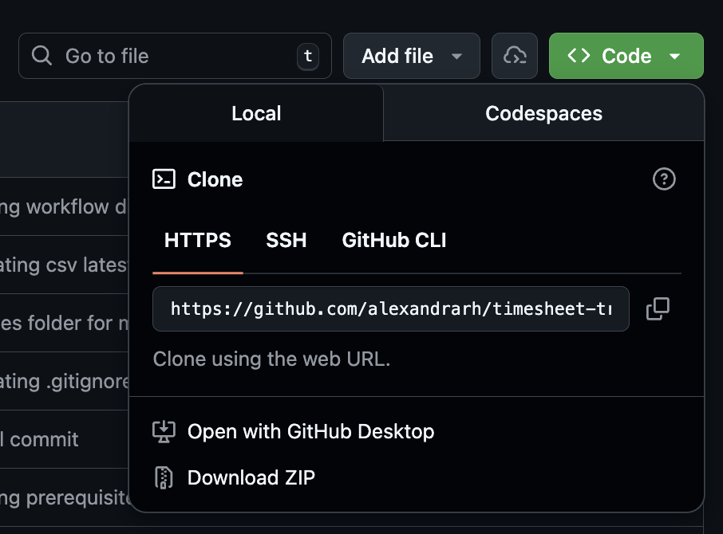
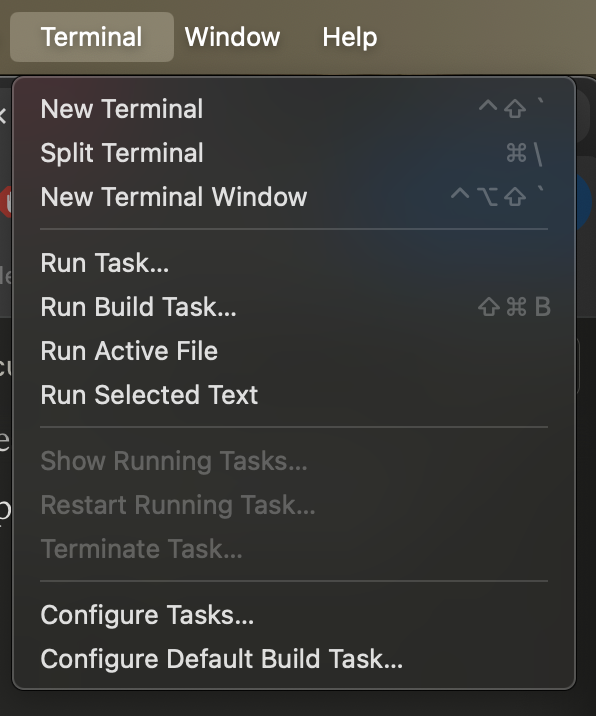

# TimeSolv Timesheet Tracker
Built with Python and GitHub Actions, this aims to validate TimeSolv firm employees' timesheets, and pick up on any users that don't submit timesheets for certain dates during the work week. This bot runs weekly to ensure everyone is evaluated accordingly.

## How it works
The checker runs automatically on a schedule and validates timesheet completeness:

<p align="center">
  
</p>

The workflow fetches user information and timesheet data from TimeSolv and user information, identifies missing entries, notifies affected users via email with calls to Microsoft Graph API, and sends a summary report to administrators.

## Prerequisites
In order to run the TimeSolv Timesheet Tracker, these components are required:
- Python 3.12+
- TimeSolv firm **and** developer account
    - Will need `client_id`, `client_secret`, `redirect_uri`, and `auth_code`
- Microsoft Graph API account (with global administrator permissions)
    - Will need `client_id`, `client_secret`, and `tenant_id`
- GitHub repository (to run automation)

## Set up 
This program can be ran locally **and/or** with automation, please refer to each section based on your needs. 

### Running on local environment (for testing purposes)
1. Clone the repository onto local environment. 
    <br><p></p></br>
2. Open the repository on IDE (preferrably Visual Studio Code) and open a New Terminal.
    <br><p></p></br>
3. In the terminal, create the virtual environment using the following command(s).
    #### If using bash/zsh
    ```shell
    python3 -m venv .venv
    ```
    #### If using Windows
    ```bat
    c:\>c:\Python35\python -m venv .venv
    ```
4. Activate the virtual environment with the following command(s).
    #### If using bash/zsh
    ```shell
    source .venv/bin/activate
    ```
    #### If using Windows
    ```bat
    C:\> .venv\Scripts\activate.bat
    ```
5. Install the proper packages from `requirements.txt` in the terminal with the following command.
```shell
pip install -r requirements.txt
```
6. Configure your `.env` file (must be created in repository on local). Follow the format below for optimal usage. 
```shell
# Email configuration
MICROSOFT_CLIENT_SECRET = [Client secret value]
MICROSOFT_CLIENT_ID = [Application identifier]
MICROSOFT_TENANT_ID = [Azure AD tenant ID]

# TimeSolv API secrets
REDIRECT_URI = [Redirect URI, can be localhost]
TIMESOLV_CLIENT_ID = [TimeSolv client ID obtained from registering app]
TIMESOLV_CLIENT_SECRET = [TimeSolv client secret obtained from registering app]
TIMESOLV_AUTH_CODE = [Auth code obtained from running TimeSolv developer set up]

# Misc/for testing
USER_ID = [Personal Timesolv User ID, your own]
SENDER_EMAIL = [Outlook email address]     
ADMIN_EMAILS = [List of admin email addresses for summary reports]
EXCLUDE_USER_IDS = [List of Timesolv User IDs to exclude from processing]
```
**NOTE:** Refer to [Configuration Guide](#configuration-guide) below on `.env` setup and obtaining proper keys for TimeSolv and Microsoft Graph API.

7. Use the following command into the terminal to run the local/test program, `local_test.py`
```shell
python local_test.py
```

### Running on production environment

## Configuration Guide