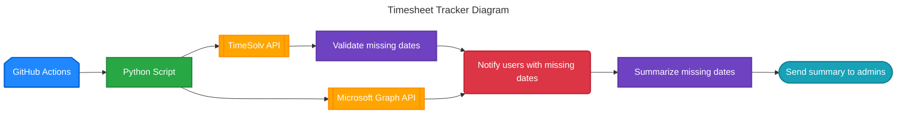

# TimeSolv timesheet tracker
TimeSolv timesheet tracker for firm

## How it works
The checker runs automatically on a schedule and validates timesheet completeness:

The workflow fetches timesheet data from TimeSolv and user information from Microsoft Graph, identifies missing entries, notifies affected users, and sends a summary report to administrators.