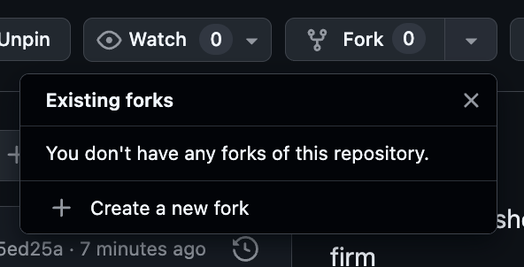
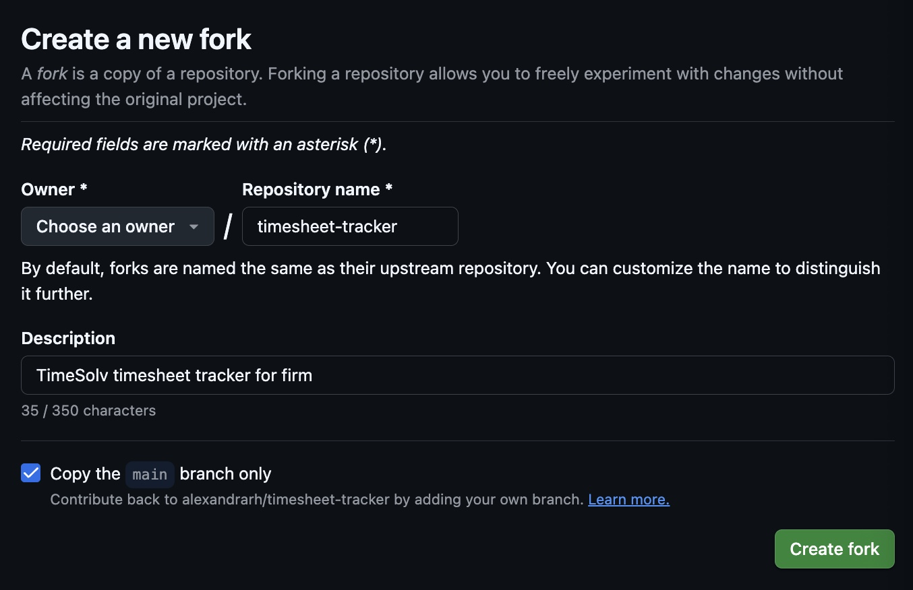
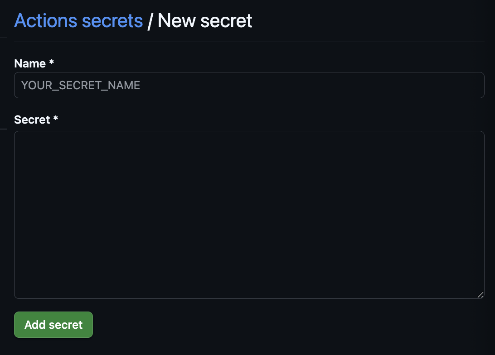
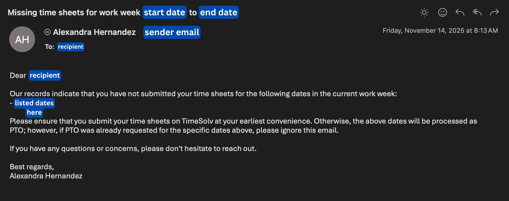
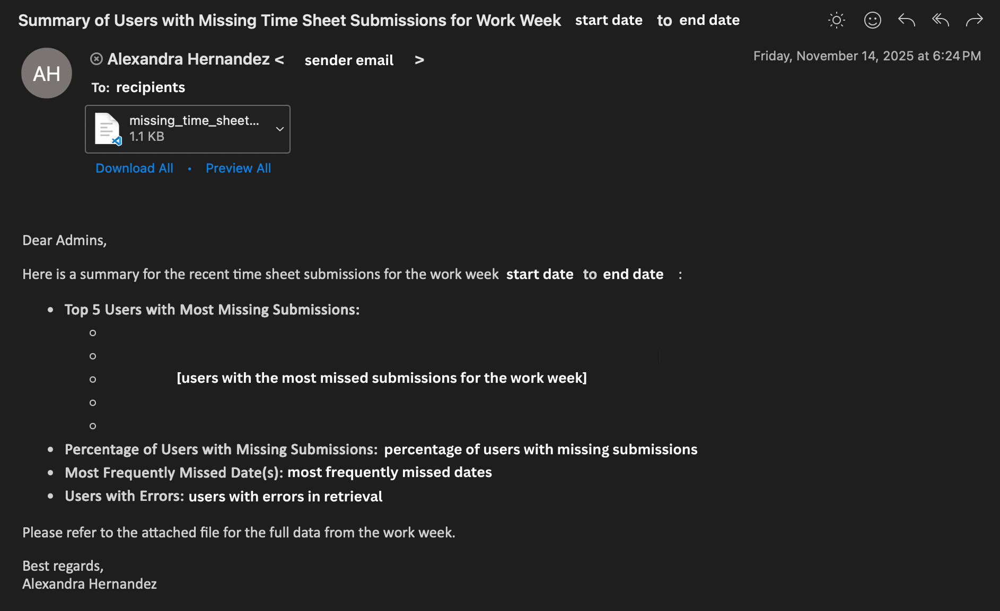

# TimeSolv Timesheet Tracker
Built with Python and GitHub Actions, this aims to validate TimeSolv firm employees' timesheets, and pick up on any users that don't submit timesheets for certain dates during the work week. This bot runs weekly to ensure everyone is evaluated accordingly.

**Current Status** <br> 
[](https://github.com/alexandrarh/timesheet-tracker/actions/workflows/actions.yaml)

## How it works
The checker runs automatically on a schedule and validates timesheet completeness:

<p align="center">
  
</p>

The workflow fetches user information and timesheet data from TimeSolv and user information, identifies missing entries, notifies affected users via email with calls to Microsoft Graph API, and sends a summary report to administrators.

## Prerequisites
In order to run the TimeSolv Timesheet Tracker, these components are required:
- Python 3.12+
- TimeSolv firm **and** developer account
    - Will need `client_id`, `client_secret`, `redirect_uri`, and `auth_code`
- Microsoft Graph API account (with global administrator permissions)
    - Will need `client_id`, `client_secret`, and `tenant_id`
- Supabase account with proper databases
    - Will need `supabase_url`, `supabase_key`, and `supabase_table_name`
- GitHub repository (to run automation)

## Set up 
This program can be ran locally **and/or** with automation, please refer to each section based on your needs. For any aspects requiring production keys/secrets, refer to the [Configuration Guide](#configuration-guide) for obtaining proper keys/secrets needed for TimeSolv and Microsoft Graph API.

### Run on local environment (for testing purposes)
To run the program locally, follow the steps below.
1. Clone the repository onto local environment. 
    <p></p>
2. Open the repository on IDE (preferrably Visual Studio Code) and open a New Terminal.
    <p></p>
3. In the terminal, create the virtual environment using the following command(s).
    #### If using bash/zsh
    ```shell
    python3 -m venv .venv
    ```
    #### If using Windows
    ```bat
    c:\>c:\Python35\python -m venv .venv
    ```
4. Activate the virtual environment with the following command(s).
    #### If using bash/zsh
    ```shell
    source .venv/bin/activate
    ```
    #### If using Windows
    ```bat
    C:\> .venv\Scripts\activate.bat
    ```
5. Install the proper packages from `requirements.txt` in the terminal with the following command.
```shell
pip install -r requirements.txt
```
6. Configure your `.env` file (must be created in repository on local). For an example on formatting, refer to [.env.example](/.env.example) in this repository. For configuration, refer to [Configuration Guide](#configuration-guide) below on `.env` setup and obtaining proper keys for TimeSolv and Microsoft Graph API.

7. Use the following command into the terminal to run the local/test program, `local_test.py`
```shell
python local_test.py
```
**NOTE**: When running the program, a `status_test.log` should be created, and it will contain any logs/output generated from the local test. There should also be two emails sent to the specified email(s) in the `.env` file (`SENDER_EMAIL` and `ADMIN_EMAILS` variables).

### Run on production environment
To run this program on a production environment, follow the steps below.
1. Fork the `timesheet-tracker` repo onto the preferred account.
    <p></p>
    <!-- <p></p> -->
2. Navigate to the forked repo's **Settings** Under the "Security" section, click on the "Secrets and variables" drop down, and go to "Actions."
3. Click on "New repository secret" to add the necessary production keys/secrets.
    <p></p>
**NOTE:** To find what secrets/key names are needed for the environment, refer to [.env.example](/.env.example) for the proper names.

4. Once the production keys/secrets are added, navigate to the "Code and automation" section (still in **Settings**), going to the "Actions" drop down. Click on "General."
5. Scroll down to "Workflow permissions" and enable the "Read and write permissions" by pressing that option, and check the "Allow GitHub Actions to create and approve pull requests" box to ensure that the `status.log` commits are successfully pushed to the repo (when the program runs).
6. Adjust the workflow schedule by navigating to the [actions.yaml](.github/workflows/actions.yaml) in the repository, and modifying the `schedule` section as shown below.
```yaml
on:
    schedule:
      - cron: '0 1 * * 6'  # Adjust this section as necessary
    workflow_dispatch: 
```
<span style="background-color: #1a395dff">Tip</span>: Create the proper scheduling in CRON by using an expression generator like <a href="https://crontab.cronhub.io/">crontab.cronhub.io</a>

By following these instructions, the production setup should be complete, and will run based on the specified schedule.

## Configuration Guide
In order to run the TimeSolv Timesheet Tracker on a local or production environment, the following keys/secrets will need to be acquired.
- `MICROSOFT_CLIENT_SECRET` 
- `MICROSOFT_CLIENT_ID`
- `MICROSOFT_TENANT_ID`
- `REDIRECT_URI`
- `TIMESOLV_CLIENT_ID`
- `TIMESOLV_CLIENT_SECRET`
- `TIMESOLV_AUTH_CODE`
- `SUPABASE_URL`
- `SUPABASE_KEY`
- `SUPABASE_TABLE_NAME` (this will be your table name)

For anything pertaining to TimeSolv, refer to <a href="https://help.timesolv.com/connect-to-timesolv-with-rest-api">TimeSolv's REST API Integration documentation</a> steps. <br>
**NOTE:** For the `REDIRECT_URI` variable, using `'http://localhost:8080/callback'` is allowable.

For Microsoft's Graph API (part of Outlook), refer to their <a href="https://learn.microsoft.com/en-us/graph/auth-register-app-v2">Authentication and Authorization</a> documentation. You can also utilize their <a href="https://developer.microsoft.com/en-us/graph/quick-start">Quick Start</a> to navigate the basics of their platform and its usage in the program.

For Supabase's API, refer to their <a href="https://supabase.com/docs/reference/python/introduction">Python version</a> documentation. Furthermore, refer to the *specific* setup for the TimeSolv Timesheet Tracker below.

### Supabase Setup
1. Create a Supabase account at [supabase.com](https://supabase.com)
2. Create a new project (note: free tier projects pause after 7 days of inactivity)
3. Create the timesheet tracking table using the SQL Editor:
```sql
   create table public.[your_table_name] (
     "UserId" bigint not null,
     "Email" text null,
     "Name" text null,
     "NoSubmissionDates" date[] null,
     "NoSubmissionCount" bigint null,
     "lastEmailSentDate" timestamp with time zone null,
     "lastUpdateDate" timestamp with time zone null,
     "Comments" text null,
     constraint [your_table_name]_pkey primary key ("UserId")
   ) TABLESPACE pg_default;
```
4. Get your credentials:
   - `SUPABASE_URL`: Dashboard → Project Settings → API → Project URL
   - `SUPABASE_KEY`: Dashboard → Project Settings → API → **service_role key** (recommended for automated scripts)
5. (Optional) Configure Row Level Security policies if using `anon` key instead of `service_role` key

### Email Configuration
- `SENDER_EMAIL`: The time administrator's email address (emails will be sent "from" this address)
- `ADMIN_EMAILS`: Comma-separated list of administrator emails to receive summary reports

## Troubleshooting
Below is a troubleshooting guide on navigating any program issues that may arise.

### TimeSolv API Issues
**Authentication Failed**
- Verify `TIMESOLV_CLIENT_ID`, `TIMESOLV_CLIENT_SECRET`, and `TIMESOLV_AUTH_CODE` are correct
- Authorization codes expire quickly. Generate a new `TIMESOLV_AUTH_CODE` if you get `401`/`403` errors
- Ensure your TimeSolv developer account has proper API access enabled
- Check that `REDIRECT_URI` matches exactly what's configured in TimeSolv (including `http://localhost:8080/callback`)

**No Timesheet Data Returned**
- Confirm your TimeSolv account has access to view firm-wide timesheet data
- Verify the date range being queried includes workdays
- Check that users exist in both TimeSolv and your firm's system

### Supabase API Issues
**Connection Failed**
- Verify `SUPABASE_URL` and `SUPABASE_KEY` are correctly set
- Ensure `SUPABASE_URL` includes the full URL (e.g., `https://your-project.supabase.co`)
- Check that `SUPABASE_KEY` is the correct key type:
  - Use the **service_role key** for server-side/admin access (recommended for this script)
  - Use the **anon/public key** only if you have Row Level Security (RLS) policies configured
- Confirm your Supabase project is active and not paused (free tier projects pause after 7 days of inactivity)
- Find keys in: Supabase Dashboard → Project Settings → API

**Authentication/Authorization Errors**
- For automated scripts, the **service_role key** bypasses RLS and is recommended
- If using the anon key, ensure Row Level Security (RLS) policies allow INSERT and UPDATE operations
- Verify the key has no extra spaces or line breaks when added to secrets

**Records Not Updating/Inserting**
- **Primary Key Conflicts**: The table uses `UserId` as primary key; ensure you're using UPSERT operations to update existing users rather than insert duplicates
- **Column Name Case Sensitivity**: Column names use PascalCase (`UserId`, `Email`, `Name`, etc.) - ensure your script matches this exactly
- **Data Type Mismatches**:
  - `UserId` must be a valid bigint (integer)
  - `NoSubmissionDates` expects an array of dates in format: `['2024-01-15', '2024-01-16']`
  - `NoSubmissionCount` must be an integer
  - `lastEmailSentDate` and `lastUpdateDate` expect timestamp format (ISO 8601)
- Check Supabase logs: Dashboard → Logs → Postgres Logs for specific error details

**Date Array Issues**
- `NoSubmissionDates` is a PostgreSQL array type - ensure your script formats it correctly:
```python
  # Correct format
  missing_dates = ['2024-01-15', '2024-01-16', '2024-01-17']
```
- Dates must be in `YYYY-MM-DD` format
- Empty arrays should be `[]` not `null`

**User ID Conflicts**
- `UserId` is the primary key and must be unique
- Use UPSERT operations (INSERT ... ON CONFLICT UPDATE) to update existing records
- If you get "duplicate key" errors, the user already exists - update instead of insert

**Null Value Errors**
- Only `UserId` is required (NOT NULL)
- All other fields (`Email`, `Name`, `NoSubmissionDates`, etc.) can be null
- If you get null constraint errors, ensure `UserId` is always provided

**Timestamp Format Issues**
- `lastEmailSentDate` and `lastUpdateDate` expect timezone-aware timestamps
- Use ISO 8601 format: `2024-01-15T10:30:00+00:00`
- PostgreSQL automatically handles timezone conversion

**Rate Limiting**
- Supabase free tier has API rate limits (~100 requests per second)
- For large firms with many users, consider batching operations
- Batch updates using Supabase's bulk insert/update features

**Data Not Appearing in Dashboard**
- Verify you're querying the correct table name
- Clear browser cache and refresh Supabase dashboard
- Run a test query in SQL Editor:
```sql
  SELECT * FROM public.no_submission_dates_test ORDER BY "lastUpdateDate" DESC LIMIT 10;
```
- Check if RLS policies are preventing you from viewing data in the dashboard

**Network/Timeout Errors**
- Check GitHub Actions network connectivity (rarely an issue)
- Increase timeout values if dealing with large datasets (100+ users)
- Verify Supabase project region for optimal latency

**Debugging Tips**
- Use Supabase Dashboard → SQL Editor to manually query and verify data structure
- Check Supabase Dashboard → Logs → Postgres Logs for detailed error messages
- Enable verbose logging in your script to see exact SQL operations
- Test Supabase connection locally first using `local_test.py` before deploying to GitHub Actions
- Verify table schema matches expectations: 
```sql
  SELECT column_name, data_type, is_nullable 
  FROM information_schema.columns 
  WHERE table_name = 'no_submission_dates_test';
```

### Microsoft Graph API Issues
**Rate Limit Errors (HTTP 429)**
- The Graph API has throttling limits (~2,000 requests per second per app)
- The script automatically retries after the time specified in the `Retry-After` header
- For large organizations, consider staggering notification emails

**Authentication Failed**
- Verify all three required secrets are set:
  - `MICROSOFT_CLIENT_ID`: Your Azure AD application (client) ID
  - `MICROSOFT_CLIENT_SECRET`: Your app's client secret value
  - `MICROSOFT_TENANT_ID`: Your Azure AD tenant (directory) ID
- Ensure secrets have no extra spaces or line breaks

**Insufficient Permissions Error**
- The Azure AD app registration requires these Application permissions:
  - `User.Read.All`: To fetch user information
  - `Mail.Send`: To send emails on behalf of users
- A Global Administrator must grant admin consent for these permissions
- Verify in: Azure Portal → App Registrations → Your App → API Permissions

**Client Secret Expired**
- Client secrets expire after 1-2 years (check expiration in Azure Portal)
- Generate new secret: Azure Portal → App Registrations → Your App → Certificates & Secrets
- Update `MICROSOFT_CLIENT_SECRET` with the new value

**Emails Not Sending**
- Confirm `SENDER_EMAIL` is set to a valid user email in your Microsoft 365 tenant
- This email address will appear as the sender of all timesheet notifications
- Verify the email has no typos and matches the time administrator's address

### GitHub Actions Issues
**Workflow Not Running**
- Check that "Read and write permissions" are enabled in Settings → Actions → General
- Verify the cron schedule syntax is correct (test at [crontab.cronhub.io](https://crontab.cronhub.io/))
- Manually trigger workflow using "Run workflow" button in Actions tab to test

**Status Log Not Committing**
- Ensure "Allow GitHub Actions to create and approve pull requests" is checked
- Verify the GitHub Actions bot has write access to the repository
- Check Actions logs for any git commit errors

**Secrets Not Working**
- Repository secrets must match exact names from `.env.example` (case-sensitive)
- Secrets are not visible after creation; if unsure, delete and recreate
- Ensure no extra quotes around secret values when pasting

### General Debugging
**Enable Verbose Logging**
- Run `local_test.py` to see detailed logs in `status_test.log`
- Check for specific API error messages and status codes
- Common status codes:
  - `401`: Authentication failed
  - `403`: Insufficient permissions
  - `429`: Rate limit exceeded
  - `500`: Server error (retry or contact API support)

## Output/Products of Program
When the Timesheet Tracker runs successfully, it produces the following.

1. **Individual User Notifications**: Emails sent to employees with missing timesheet entries.
   - Lists specific dates with missing timesheets
   - Sent from the configured `SENDER_EMAIL` address
   - Helps employees catch up on incomplete submissions

2. **Admin Summary Report**: Comprehensive email sent to administrators (specified in `ADMIN_EMAILS`).
   - Overview of all users with missing timesheets
   - Count of missing dates per user
   - Sent after individual notifications complete

3. **Status Logs**: Detailed execution logs for debugging and auditing; contains timestamps, API calls, and any errors encountered.
   - `status.log` (production): Committed to the repository after each run
   - `status_test.log` (local testing): Created in local directory

### Example Email Structure
#### User Email
Below is what a user will receive if they are missing a date in their timesheet.
<p></p>

#### Summary Email
Below is what admins will receive at the end of the workflow to their email.
<p></p>

## Contact
If there are any other questions/concerns, please reach out to <a href="mailto:alexavndrarh@gmail.com">alexavndrarh@gmail.com</a> for help.
